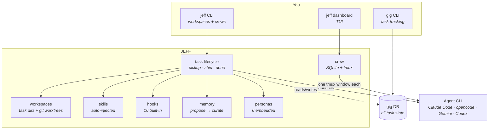
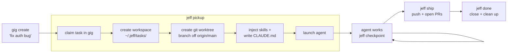
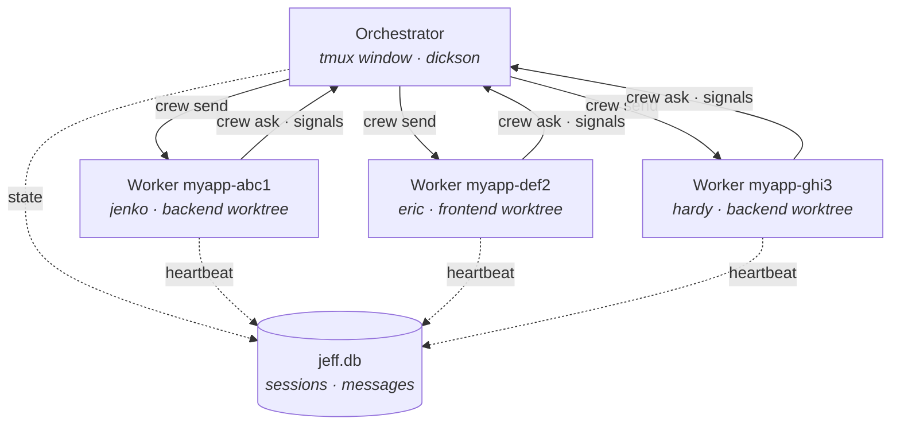
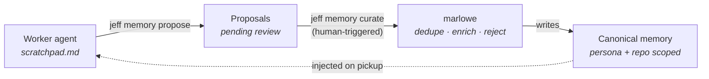

# JEFF

Agent workspace manager built on [gig](https://github.com/NeerajG03/gig). JEFF gives AI agents structured workspaces, personas, skills, memory, and task lifecycle management — from solo tasks to multi-agent crews.

**New here? Two ways to start:**

- **[Let an agent set it up for you](#set-up-with-an-agent)** — paste one prompt, answer a few questions.
- **[Do it yourself in 5 minutes](#quick-start-5-minutes)** — six commands, no guessing.

---

## Set up with an agent

JEFF has a lot of surface — repos, skills, personas, memory, hooks, crew mode. Rather than reading all of it, paste this into Claude Code, opencode, Gemini CLI, OpenAI Codex, or any agent with shell access:

```
Set up JEFF on this machine for me.

Fetch and follow this runbook exactly:
https://raw.githubusercontent.com/NeerajG03/JEFF/main/docs/agent-setup.md

Ask me the questions it lists (task ID prefix, agent CLI, IDE, which repos,
whether I want crew mode), run the commands, verify each step, and stop and
show me the output if anything fails. Don't touch an existing JEFF install
without asking me first.
```

The runbook ([`docs/agent-setup.md`](docs/agent-setup.md)) is written for agents: every step has a verification command, every decision point is an explicit question, and it ends by taking one real task through the full lifecycle so you know the whole chain works.

---

## Prerequisites

| | What | Why |
|---|---|---|
| **Required** | [gig](https://github.com/NeerajG03/gig) | The task database. JEFF stores no task state of its own. |
| **Required** | git | Worktrees are how task isolation works. |
| **Required** | An agent CLI: [Claude Code](https://claude.com/product/claude-code), [opencode](https://github.com/anomalyco/opencode), [Gemini CLI](https://github.com/google-gemini/gemini-cli), or [OpenAI Codex](https://learn.chatgpt.com/docs/cli) | The thing JEFF launches. |
| **Required** | jq | Used by the generated hook scripts. |
| For `jeff ship` | [`gh`](https://cli.github.com), authenticated | Pushing branches and opening PRs. |
| For crew mode | tmux ≥ 3.0 | Each worker gets a tmux window. |
| macOS extra | `terminal-notifier` | `jeff notify` desktop notifications. |

Run `jeff doctor` any time to see what's missing.

## Install

### Homebrew (macOS/Linux)

```bash
brew install neerajg03/tap/gig     # the task database — install this too
brew install NeerajG03/tap/jeff
```

### Go

```bash
go install github.com/NeerajG03/gig/cmd/gig@latest
go install github.com/NeerajG03/JEFF/cmd/jeff@latest
```

If the binaries aren't found afterwards, add Go's bin dir to your PATH: `export PATH="$PATH:$(go env GOPATH)/bin"`.

### From source

```bash
git clone https://github.com/NeerajG03/JEFF.git
cd JEFF && go build -o /tmp/jeff-dev ./cmd/jeff/
```

> Build to a throwaway path, not onto your PATH. Replacing a live `jeff` binary kills any crew workers currently running against it.

## Quick Start (5 minutes)

```bash
# 1. Create the task database. Task IDs will look like myapp-a3f8.
gig init --prefix myapp

# 2. Create the JEFF home at ~/.jeff/ (dirs, hooks, personas, skills, memory).
jeff init

# 3. Confirm dependencies are in place.
jeff doctor

# 4. Tell JEFF which agent CLI and editor you use.
jeff config agent claude       # claude | opencode | gemini | codex
jeff config ide cursor         # vscode | cursor | windsurf | nvim

# 5. Register a codebase. JEFF clones it into ~/.jeff/repos/backend.
jeff repo add https://github.com/org/backend.git --name backend

# 6. Create a real task and pick it up. Use the ID gig prints back.
gig create "Fix the login redirect" --type bug --priority 2
#   → Created myapp-7c1e
jeff pickup myapp-7c1e --persona jenko --repos backend
```

Step 6 claims the task, builds a workspace with a git worktree, injects matching skills, writes a `CLAUDE.md` with your persona and task context, and launches your agent inside it.

Then, as you work:

```bash
jeff checkpoint --done "Fixed the redirect" --next "Add a regression test"
jeff ship --dry-run                      # rehearse; then drop --dry-run to open PRs
jeff done myapp-7c1e --reason "shipped"
```

Two defaults worth knowing up front:

- **Permission prompts are disabled** for launched agents (`skip_permissions: true`). Set it to `false` in `jeff.json`, or pass `--safe` on `pickup`/`work`/`crew start` for one run.
- **All hooks are enabled** unless you turn them off. See `jeff config hooks list`.

## How It Works

### Architecture at a glance

JEFF sits between you and one or more AI agents. Task state lives in gig, crew state lives in SQLite, code lives in git worktrees — JEFF wires them together and hands the agent a ready-to-code workspace.



### Task lifecycle



Task directories are ephemeral — gig is the source of truth, so a workspace can be destroyed and rebuilt from the task's checkpoints at any time.

## Multi-Agent Crews

Run multiple AI agents in parallel, each in its own tmux window with a dedicated task workspace.

```
jeff-work (tmux session)
├── tab 1: orchestrator  ← you live here, coordinating
├── tab 2: myapp-abc1    ← worker 1 (jenko, implementing)
├── tab 3: myapp-def2    ← worker 2 (eric, researching)
└── tab 4: myapp-ghi3    ← worker 3 (hardy, reviewing)
```

The orchestrator and workers communicate through durable messages (logged in SQLite, delivered to tmux panes, replayed on session start if a worker was down):



### Start an orchestrator

```bash
cd ~/projects/my-project                # orchestrator identity is per-directory
jeff orchestrator init                  # register the identity — required before crew start
jeff orchestrator start --name work     # creates tmux session jeff-work
```

`jeff crew start` fails with *"no orchestrator identity found"* if you skip `jeff orchestrator init` in the directory you're orchestrating from.

### Launch workers

```bash
jeff crew start myapp-ab12 "Fix the issue" --persona jenko --repos backend
jeff crew start myapp-cd34 "Research the API" --persona eric --repos backend,frontend
jeff crew start myapp-ef56 "Review the diff" --persona hardy --repos backend --model opus
```

### Monitor and communicate

```bash
jeff crew list                          # show workers (filtered to current orchestrator)
jeff crew status myapp-ab12             # detailed worker status + pane output
jeff crew events --since 5m             # recent activity across all workers
jeff crew capture myapp-ab12 --lines 30 # raw terminal output

# Message workers (stored in inbox + delivered to pane)
jeff crew send myapp-ab12 "add error handling"
jeff crew send myapp-ab12 "stop, focus on payments" --interrupt  # Ctrl-C first

# Workers can ask the orchestrator questions
jeff crew ask "should I use JWT or session tokens?"
jeff crew ack <msg-id> "use JWT"
```

### Manage lifecycle

```bash
jeff crew resume myapp-ab12              # resume stopped worker (restores agent session)
jeff crew stop myapp-ab12                # graceful stop
jeff crew stop --all                     # stop all workers
jeff crew cleanup                        # reconcile tmux vs DB state
jeff cleanup                             # collect retired workspaces + orphaned worktrees
jeff orchestrator info                   # show all tasks under orchestrator
jeff orchestrator stop jeff-work         # stop orchestrator + all workers
```

### Dashboard

```bash
jeff dashboard                          # interactive TUI (auto-refreshes every 2s)
```

## Commands

| Command | Description |
|---------|-------------|
| **Setup** | |
| `jeff init [--here] [--update]` | Initialize or sync JEFF home |
| `jeff doctor [--json]` | Check dependencies |
| `jeff config [agent\|ide\|hooks\|opencode\|reset-claude-md]` | View and update configuration |
| `jeff completion [bash\|zsh\|fish]` | Shell completions |
| **Task lifecycle** | |
| `jeff pickup <id> [--persona] [--repos] [--safe]` | Claim task, set up workspace, launch agent |
| `jeff work [id] [--safe]` | Resume work in an existing task workspace |
| `jeff checkpoint --done "..."` | Save a structured progress snapshot |
| `jeff ship [--repo] [--draft] [--dry-run]` | Push branches and create PRs |
| `jeff done [id] [--reason] [--force] [--purge]` | Close task, remove its worktrees, retire the workspace |
| `jeff cleanup [--dry-run] [--force] [--older-than]` | Collect retired workspaces + orphaned worktrees, reclaim disk |
| `jeff status [--all]` | Overview of active tasks and workspaces |
| `jeff stats [--since 30d] [--persona] [--repo] [--outcome] [--json]` | Observability over gig events and attributes |
| `jeff open [id]` | Open workspace in IDE |
| `jeff notify` | Surface a macOS system notification |
| `jeff project init\|open\|list` | Manage JEFF projects |
| **Crew orchestration** | |
| `jeff orchestrator init` | Register an orchestrator identity in this directory (do this first) |
| `jeff orchestrator start [--name]` | Launch orchestrator tmux session |
| `jeff orchestrator list` | List orchestrator sessions |
| `jeff orchestrator info [id]` | Show all tasks under an orchestrator |
| `jeff orchestrator attach <id>` | Attach to orchestrator session |
| `jeff orchestrator stop <id>` | Stop orchestrator and all workers |
| `jeff crew start <id> "<prompt>" [--persona] [--repos] [--model] [--safe]` | Launch worker in tmux |
| `jeff crew resume <id>` | Resume stopped worker (restores agent session) |
| `jeff crew list [--all]` | List workers (filtered to current orchestrator by default) |
| `jeff crew status <id>` | Worker detail + checkpoint + pane output |
| `jeff crew send <id> "msg" [--interrupt]` | Message a worker (stored + delivered to pane) |
| `jeff crew ask "question"` | Worker asks orchestrator a question |
| `jeff crew ack <msg-id> ["response"]` | Acknowledge worker question |
| `jeff crew events [--since]` | Recent gig activity across workers |
| `jeff crew capture <id> [--lines]` | Raw terminal output from worker pane |
| `jeff crew stop <id> [--all]` | Stop worker(s) |
| `jeff crew cleanup` | Reconcile tmux state vs DB |
| `jeff crew attach <id>` | Attach to a worker's tmux window |
| `jeff dashboard` | Interactive TUI dashboard |
| **Resources** | |
| `jeff repo add\|list\|remove\|sync\|describe\|post-setup` | Manage registered codebases |
| `jeff worktree add\|rm [--force]\|list` | Manage git worktrees |
| `jeff skill doc\|list\|show\|add\|remove\|tag\|inject\|eject` | Manage agent skills |
| `jeff persona list\|show\|add\|remove\|tag` | Manage personas |
| `jeff memory list\|show\|add\|propose\|curate\|disable` | Manage persona memory and repo learnings |

## Personas

Shape agent behavior with embedded personas. Each has a default model for cost optimization.

| Persona | Role | Default model | Use when |
|---------|------|--------------|----------|
| **jenko** | Implementer — writes code, ships | opus | Building features, fixing bugs |
| **schmidt** | Debugger — traces root causes | opus | Investigating issues, debugging |
| **dickson** | Orchestrator — plans, delegates, writes no code | opus | Breaking down epics, coordinating |
| **eric** | Researcher — explores, documents, changes no code | sonnet | Investigating code, researching |
| **hardy** | Reviewer — checks quality | sonnet | Code review, PR review |
| **marlowe** | Memory curator — consolidates proposals into canonical memory | sonnet | `jeff memory curate` |

```bash
jeff persona list
jeff pickup myapp-ab12 --persona jenko --repos backend
jeff crew start myapp-ab12 "Fix the issue" --persona schmidt --repos backend --model opus
```

Add your own with `jeff persona add <path>`.

## Skills

Skills are reusable `SKILL.md` instructions auto-injected into task workspaces based on persona, task type, or tags.

```bash
jeff skill doc                          # how to author a skill
jeff skill add ./my-skill               # register a skill
jeff skill tag my-skill --persona jenko # tag for auto-injection
jeff skill inject slack notion          # inject into JEFF home
jeff skill list                         # see all skills
```

The `crew-orchestrator` skill is embedded in the binary and auto-installed on `jeff init`.

## Agent Memory

JEFF maintains persistent memory across sessions:

- **Persona memory** (`personas/<name>/memory/`) — per-persona knowledge that carries across tasks
- **Repo learnings** (`learnings/<repo>/`) — repo-specific quirks and patterns
- **Scratchpad** (`scratchpad.md` in the task dir) — raw observations during a session

Agents call `jeff memory propose` to capture an observation. Promotion is deliberate: you run `jeff memory curate` (marlowe) to consolidate proposals into canonical memory. Nothing auto-promotes.



## JEFF_HOME

Resolved via `JEFF_HOME` env var → `~/.config/jeff/home` pointer file → `~/.jeff/` default.

```
JEFF_HOME/
├── CLAUDE.md           # agent instructions (editable; jeff config reset-claude-md restores)
├── jeff.json           # config: agent, IDE, repos, hooks
├── .claude/ .opencode/ # per-agent settings + hooks
├── hooks/              # generated hook scripts
├── scripts/            # your scripts (branch naming, post-setup)
├── repos/              # registered codebases (git clones)
├── tasks/              # active task workspaces (ephemeral)
├── worktrees/          # centralized git worktrees (symlinked into tasks)
├── projects/           # project workspaces
├── .skills/  .personas/
└── exports/            # generated artifacts
```

## Configuration

JEFF is configured via `jeff.json`, with a [JSON schema](https://raw.githubusercontent.com/NeerajG03/JEFF/main/schemas/jeff-config.json) for editor autocompletion.

```json
{
  "$schema": "https://raw.githubusercontent.com/NeerajG03/JEFF/main/schemas/jeff-config.json",
  "agent": "claude",
  "ide": "cursor",
  "repos": {
    "backend": {
      "url": "https://github.com/org/backend.git",
      "description": "Go API service",
      "base_branch": "origin/develop",
      "branch_name": "scripts/branch.sh",
      "post_setup": "scripts/setup.sh"
    }
  },
  "hooks": {
    "gig-ready-tasks": true
  },
  "skip_permissions": true
}
```

`jeff done`, `jeff worktree rm` and `jeff cleanup` refuse to discard a worktree with uncommitted changes unless `--force` is passed.

`jeff done` removes the task's worktrees (the disk cost) but **keeps the task directory**, marking it `.closed`. That directory holds the running session's hook scripts and working directory, so deleting it on close broke every hook in that session. `jeff cleanup` collects retired directories once no worker is anchored to them.

See [docs/config.md](docs/config.md) for the full reference.

## Documentation

| Doc | Contents |
|---|---|
| [docs/agent-setup.md](docs/agent-setup.md) | Agent-executable setup runbook (the paste-a-prompt path) |
| [docs/usage.md](docs/usage.md) | Full command usage by lifecycle stage |
| [docs/config.md](docs/config.md) | Configuration reference — repos, hooks, branch naming, IDE |
| [docs/adding-commands.md](docs/adding-commands.md) | Adding a new CLI command |
| [docs/testing.md](docs/testing.md) | Test infrastructure |
| [docs/roadmap.md](docs/roadmap.md) | Where JEFF is going |
| [CLAUDE.md](CLAUDE.md) | Repository guide for agents working on JEFF itself |

## License

MIT
